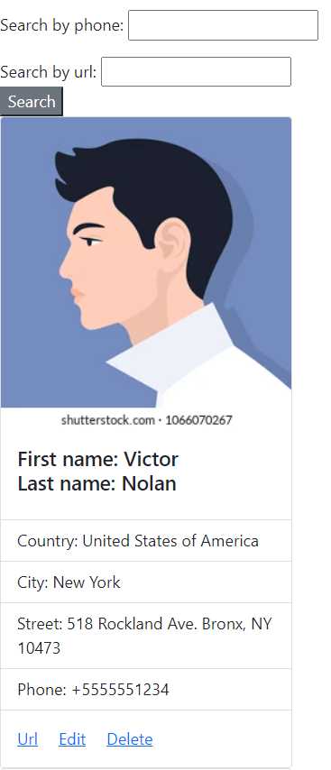

# address_book
## Python django application for managing contacts
### Features:
* Supports search by all the contact fields.
* Supports CI that automatically runs pytest tests
* Supports CD for automatic deploy to AWS EC2 instance
* Application is run via docker containers
* Production environment already tested and configured using nginx and gunicorn



## Prerequisites
* Install docker https://docs.docker.com/engine/install/
* Install docker compose https://docs.docker.com/compose/install/

## Configure envs
### Important! Change DJANGO_SECRET_KEY before usage!

Django config: src/.env
```
DJANGO_DEBUG_MODE=false
DJANGO_SECRET_KEY=django-insecure-i00tygfvwjav1f%5qsu9)otzd&7k*hj^57=qdvoxg^5d=ac8lw
```

Nginx config: .env
```
NGINX_SERVER_HOSTNAME=localhost
NGINX_SERVER_PORT=80
```

## Run database migration
```
docker compose run gunicorn python3 manage.py makemigrations
docker compose run gunicorn python3 manage.py migrate
```

## Run server with following command

```
docker compose up
```
